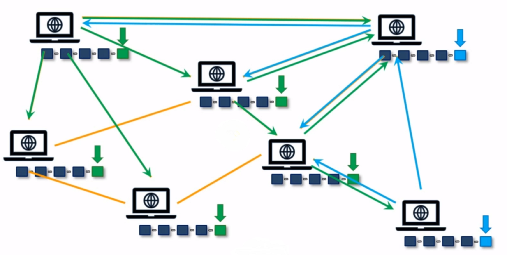

# CryptoWallet
This project is a simple crypto currency wallet and local blockchain implementation using object oriented programming in Python. This includes implementation of blockchain which includes mining, proof of work algorithm and consensus algorithm. Nodes can be configured and added to the blockchain network and wallet i.e. blockchain client can interact with these nodes to send and receive crypto currency.    
Technologies used:
In this project we make use of the following technologies:
1] Flask framework for creating routes to link the server side programming done in Python language.
2] Pycryptodome module for classes and methods used for hashing and encryption purposes.To use the RSA and SHA256 encryption algorithms.
3] Jquery for Javascript scripting in client side programming and handling json data(frontend).
4] HTML and CSS (Bootstrap) to create a structured webpage with proper styling(frontend).

<b>Theory on Blockchain Technology:</b>

<b>What is a Blockchain?</b>

Blockchain is an immutable ledger stored in each node of a decentralized distributed system where clients do not interact with a single server that is vulnerable to attacks by a skilled attacker, but instead the client interacts with a peer to peer distributed network which maintain their own immutable ledgers where even a very skilled attacker has a high possibility of failure which may be caused due to lack of energy resources since cracking through a P2P network requires high computation and processing power.This is made more clear further in the explanation of this technology.

The following figure describes how data is stored in such a system:	

 

In the above figure each block (numbered 1,2,3) contains data which is sensitive to manipulation outside of the block. Once the data is stored in the block it is protected by two layers of security. To understand the security layers provided by the technology we need to understand some prerequisites:

⦁	Firstly,lets take a look at the contents of each block:

			 
The content includes:

1.	<b>Block number:</b> The block number is the position of the block from the start of the chain.The very first block has the block number 1 and it has a previous hash value of '00000...' since it is the very first block.This block is usually empty and also has a nonce value of 0.It is called the Genesis block.

2.	<b>Nonce:</b> This is the only field that can be manipulated in the block. This is used by miners who add the transactions to the blockchain to solve a cryptographic puzzle which is generated by the system itself i.e. this puzzle is generated in the program on which the entire system functions.This is further explained in 'Mining'.

3.	<b>Previous Hash:</b> This is the hash value of the previous block in the blockchain system. Each block has its own hash which is generated by hashing algorithms like SHA256,SHA2,MD family (2,4,5,6). The last 2 i.e. SHA2, MD family have been cracked and hence these hashing algorithms are no longer used.The hash of the previous block is present in following block to create a link between the two.

4.	<b>Hash:</b> This is the hash value of the current block.The hash of the block is created using a hash algorithm as explained earlier.In this project we make use of the SHA256 hashing algorithm(many systems use this algorithm to encrypt their data even today, other than users of this technology).We choose this algorithm as there are certain requirements that this algorithm fulfills inorder for it to be most suitable.These include:

    a.	One-way: This means that the hash generated by the algorithm should not be able to produce back the data through which the hash was generated. In case of blockchain the signature on each transaction ,for verification purposes, is created by using the hash algorithm on the private and public key (generated in wallet of each user) of user.Thus if the algorithm is two way, the private key can be found out by an attacker and the money of the sender is compromised.
  
    b.	 Deterministic: This means that for same input value same hash must be produced.
  
    c.	Fast computation: Since the miners in the system are continuously adding the pending transactions to the blocks the hash algorithm's computation must be fast so that the adding of transactions to the blockchain does not take much time.
  
    d.	Avalance effect: Even the smallest change in the input to hash algorithm must generate a completely different hash.This is necessary since, if the attacker finds a pattern to generate hashes then data can easily be compromised also this makes mining very difficult thus making the rewards earned by the miners have proper value  suitable to the effort and loss of resources on miner's side.For the hashing algorithms SHA2, SHA1 and MD family the patterns to find the hash has been cracked and hence these are not secure   anymore unlike SHA256 which has still not been cracked and thus a safer option. 
  
    e.	Must withstad collision: Collision occurs when two documents, as input to hash algorithm, produce the same hash.This is not a probem  but it should be difficult for the attacker to produce document with same hash. 
  
	  The hash of each bock is created using the SHA256 hashing algorithm on block 	number,nonce,data and previous hash. 
  
⦁	<b>Security Layer 1-Immutable Ledger:</b> 

  Since the previous hash is also included as input to SHA256 hashing algorithm to produce the current block's hash,if the data input is manipulated by an attacker then the hashes of all the following blocks are changed and due to a validation process in the system itself, the mismatch created is resolved by overwriting the blockchain to its previous state i.e. what it was before the attack, by using any of the copies in the other nodes of the system. But still the attacker can change the data in that particular blockchain by having a computer with exceptional processing power and proper synchronisation with the validation system.Even though this is an extreme case it can be handled by the next layer of security.

⦁	<b>Security Layer 2-Peer to peer network:</b>

  Even if the attacker manages to change the data of a partuclar node's blockchain, the consensus protocol of the system dictates that more than 50% of the blockchains at a given time should match. All the nodes in the system have a copy of the blockchain and if less than 50% of these copies do not match then they are overwritten. Thus if the attacker has to preserve the changes he/she made to the blockchain of one node then he/she has no option but to  change the contents of more than 50% of the nodes' blockchains which means changing the content of the blockchains in hundreds (incase of permissioned blockchains in a localized setting) or even millions (incase of non permissioned blockchains available to the public like Bitcoin) of computers which is almost impossible and has never been done.
  This turns an untrusted environment to a trusted environment.Though we do not know the different people operating the computer systems on every node (thus there is no trust), the protocol is what runs the network and we can trust it as even the developer of the protocol cannot manipulate it after deployment due to its transparency.
  
<b>Mining in blockchain system:</b>

Since the blockchain system is decentralized i.e. there is no central server or computer or any central third party controlling the entire system, the right to adding data to the blockchain is handed over to particular nodes in the system known as miners.The miners add the data to the blockchain through the process called as Mining.
  
The following has to be noted inorder to understand how mining works:	

⦁	Hash generated by hashing algorithm is just a number with a hexadecimal representation with a fixed length of 64 characters.

⦁	With increasing number of leading 0s in hexadecimal representation, the value of the number i.e. value of hash, decreases.

⦁	Avalanche effect, which means that with even the smallest change the hash completely changes.

⦁	Nonce value in the block is the only value which can be manipulated.

Keeping the above points in mind,we can now discuss how mining actually works.

⦁	The miner is given the data,blocknumber,previous block's hash for the particular block to be mined by him/her.

⦁	The nonce value has to be chosen by the miner's computer system in accordance with the criteria set by the system for the hash to be generated for that particular block.The criteria which the hash value has to fulfil depends on the number of leading 0s in that particular hash.In other words the hash created by changing the nonce value by the miner should contain a particular number of leading 0s which is set by the system itself.

⦁	Due to the avalanche effect the difficulty of mining increases drastically as there is no particular pattern that the system can follow to produce a nonce value corresponding to the set criteria.

⦁	Lets consider the following figure in which the top right corner has highest value i.e. FFFF...64 times and bottom left corner has lowest value i.e. 00000...64 times. This means that evey point in the figure has a particular hash value associated with it and the entire figure has all possible hash values.If we move from left to right the value increases and the same happens when we move upwards. Thus the number of leading 0s usually decreases as we move rightwards and upwards. 

⦁	The target line represents a set of specific values of hash which are acceptable.Any value of hash equal to value on target line or below it is acceptable.Thus a nonce value has to be guessed by the miners system to achieve an acceptable hash value. The smaller the target region , the more the number of leading 0s and lesser the probability of finding an acceptable hash value.In case of a larger number of miners the area is made smaller since with an increase in the number of miners the chances of mining should not always favour a particular miner which will be the case if the difficulty of the does not increase and only a single miner will profit. 

⦁	The miners system has no choice but to use Brute Force method inorder to guess the acceptable value of nonce. This requires a lot of processing power and hence causes a lot of consumption of resources like electrical energy and puts high pressure on the processor which overheats it thus requiring a cooling system.So how is this cost for the miner covered?How does the miner profit?

⦁	Whenever a miner provides a proof of work by adding transactions to the blockchain, he/she is rewarded for doing so in 2 ways:
  1.	Cryptocurrency generated by the system are rewarded to the miner.
  2.	A transaction fees given by user for transaction is also rewarded to the miner
  
⦁	The above transactions are also included in the block mined by the miner.

⦁	Thus the above system provides incentive for people to become miners and take responsibility of adding the data to the blockchain.
 Consensus protocol:
      There are two main challenges that the distributed decentralized systems face:
    ⦁	1st challenge: If changes are made to the data while adding a block at the end of the blockchain or to an existing block.
    ⦁	2nd challenge: Since the nodes in the system are separated by huge distances as this system allows nodes to be countries and continents apart, there is some delay to             detect updation in blockchain by nodes. It may so happen that till one node recieves the updation of a new block on the blockchain, it may have already mined a block in         its place and sent the signal for updation to some of its neighbouring nodes. In such cases conflict occurs on which block is to be added to the blockchain and a protocol       is required inorder to resolve this issue.
    
 There are 3 protcols which solve this problem:
 
  a.	Proof of Work
  
  b.	Proof of State
  
  c.	Others
  
 Here we make use of Proof of Work.The following points describes how this protocol works.
 
  a.	 First we take into consideration the first challenge.To resolve this, we firstly keep an incentive for the miner to play fair. If there is any changes to be made to         data field of the block, the miner is the only one to do so. If the miner mines the data into the blockchain fairly, he/she is rewarded as discussed earlier. If the             block mined is found to be malicious then it is removed and written again by some other miner and the reward is lost.Thus instead of a technical solution to this problem         we have found an pyschological solution to the problem by providing an economic incentive to the miner.
        
  b.	Even if the attacker has the incentive in mind and he still decides to add a malicious block to the blockchain then it will be removed.Once a block is added, all the         nodes in the network add that block to their copy of the blockchain and verify the content of the block.
        
  c.	The list for verification is provided below.This list is very strict and takes into consideration all the variables that maybe changed by the attacker to manipulate         the data.  
  
  
  
        
  d.	A cryptographic puzzle is hard to solve but easier to verify and hence it will be more beneficial to use the processing power to mine fairly and be rewarded than             risk losing the reward plus bearing the economic loss due to high consumption rates.
        
  e.	Now we take into consideration the 2nd challenge i.e. the delay problem.Let us take use the following case: In this case the node in top left added green block to           the blockchain but due to delay the update to blockchain was not detected by the node in bottom right which added its own blue block to the blockchain.The node which             added the green block sent the updation for verification to 4 nodes and the one which added the blue block sent only one node the updation information.
  
  
  
  
        
  f.	At this point there is a conflict on which block is to added to the blockchain. This conflict is resolved by suspending the system until a new block is added to the         system.There is a rule dictated by the consensus protocol that states that "the longest chain is the king".Let us assume that the cummulative computational power of the         five systems that added the green block is higher than that of the systems that added the blue block.This means that these systems have higher chances of mining a block         than the two systems.
        
  g.	If another green block is added i.e. if any of the five systems that contain green block in their copy of the blockchain mine another block to the blockchain then           due to the consensus protocol rule stated earlier, the copy blockchain of the green system will suffice and the blue blocks will be removed and replaced by the green             blocks newly added to the blockchain.Refer diagram below.
  
  
  
  
 
  h.	The blue block has been mined by the bottom right system thus the reward associated to it also lost along with the transactions.There is no other option than                 removing the nodes.Thus it i always recommended in a non permissioned peer to peer blockchain system to wait for atleast 6 blocks to be added after the block with your           transactions to ensure that your transaction is confirmed and infact a part of the blockchain and not "orphaned".
        
This way the consensus protocol resolves both the challenges faced by the decentralized   distributed systems.
    
<b>IMPLEMENTATION:</b>

The technologies mentioned earlier are used to implement an application of the blockchain system which is to create a cryptocurrency exchange which has the functionality of both the user i.e. sender and reciever, as well as the miner side i.e. nodes, which use this cryptocurrency exchange.
Each user has a wallet which generates the public and private key for transactions.The public key is used to recieve transactions. It can be given to other people, as the name suggests, and is analogous to a bank account number.The private key is used to sign the transactions to make them verified from sender's side.This key needs to be kept a secret and if this key value is compromised, it can cause the loss of cryptocurrency and sensitive details of the user.
The project is divided into 2 parts both for frontend and backend development:

⦁	The first part is the user's side.The interface developed is used for wallet generation which in turn generates the user's private and public key. This also includes two other interfaces for making transactions and viewing transactions.

⦁	The second part is the node's side.The interface developed is used for mining and another interface is used to configure current node with other nodes such that it knows the presence of other nodes.

 
Functionality of each client will be encapsulated on a web server and the web server will run on different ports.In an actual scenario these ports may be the same since the programs will run on different computers with different IP addresses.Since we are using a local machine to run the programs, the different connections to the web server are made through different ports as the IP address for all the connections are common.
